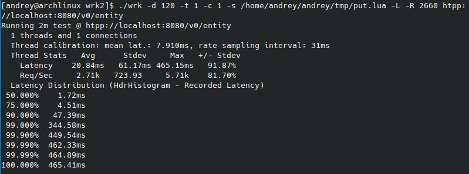
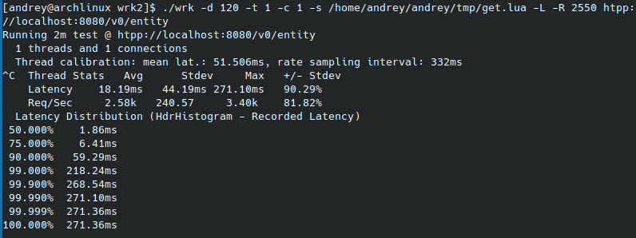
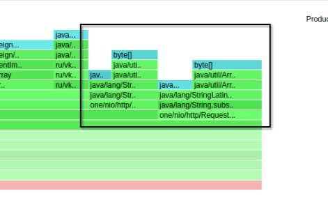
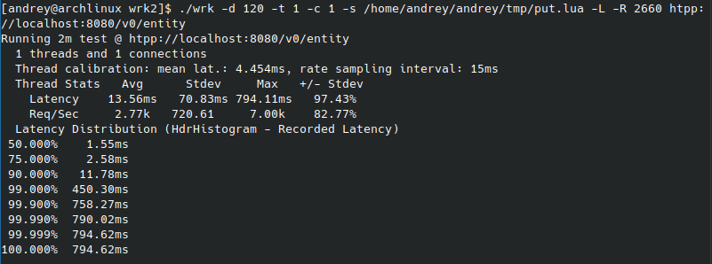

### Для проведения нагрузочного тестирования было написано 2 скрипта на lua:
* put.lua: для запроса в качестве id используется число типа long и для каждого последующего запроса это число инкрементируется, для всех ключей в качестве value используется строка "hello";
* get.lua: при получении значения для каждого запроса генеруется случайное число из диапазона значений ключей, которые находятся в хранилище.

### Определение точки разладки для запросов типа PUT:
* Исходя из полученых результатов, можно определить точку разладки: rps = 3800 при threads = 1, connections = 1, duration = 20;
* Вычислим rps стабильной нагрузки для дальнейшего тестирования: rps_st = 3800 * 0.85 = 3230.  
* Впоследствии было замечено, что при тестировании на протяжении 2х минут при rps = 3230 API не выдерживает. Принято решение взять rps_st = 0.7 * 3800 = 2660.
* Результаты работы wrk2 при стабильной нагрузкe на протяжении 2х минут: 

### Определение точки разладки для запросов типа GET:
* Хранилище было заполнено на 69 МБ, включая в себя 2030000 пар.
* Для получения ключа использует функцию случайного генерации ключа в диапазоне 0..2031000.
* Исходя из полученых результатов, можно определить точку разладки: rps = 3000 при threads = 1, connections = 1, duration = 20;
* Вычислим rps стабильной нагрузки для дальнейшего тестирования: rps_st = 3000 * 0.85 = 2550.
* Результаты работы wrk2 при стабильной нагрузкe на протяжении 2х минут: 

### Профилирование запросов типа PUT:
* Профилирование CPU: 
* Все аллокации: 
* Аллокации в методе handleRequest: 
	* Аллокация id, как параметра метода put по аннотации @Param.
		* Используется метод fromString для формирования MemorySegment (тут аллокация массива byte[]).
	* Аллокация класса Response при каждом вызове метода.
	* Двойная аллокация Request.getPath, произошедшая по причине того, что сначала мною обрабатывался запрос в переопределенном методе handleRequest для фильтрации некорректных запросов, а потом вызывался метод super.handleRequest для вызова метода обработчика по аннотации @RequestMethod.
	

### Профилирование запросов типа GET:
* Профилирование CPU: 
* Все аллокации: 
* Аллокации в методе handleRequest: 
	* Двойная аллокация Request.getPath (также как и при PUT запросе).
	* Аллокация через Response.ok(). 

### Доработка
* Были убраны все аннотации @Path, @Param, @RequestMethod
* Вся обработка осуществляется через метод handleRequest()
* Убрана двойная аллокация через getPath()

Попытка оптимизировать возвращение результата с кодом OK и body:
* Было замечено, что в используемом конструкторе Response() происходит двойная аллокация строки "Content-Length: " + body.length (на FlameGraph видно вызов метода StringConcatHelper.newString()).
	* "Content-Length: " можно было бы закешировать, однако класс Response не позволяет гибко задавать заголовки.

### Профилирование запросов типа PUT после доработки:

* Аллокации в методе handleRequest: 
* Результаты работы wrk2 при стабильной нагрузкe на протяжении 2х минут: 
* Сравнение HrdHistogram до и после (-d 120 -R 2660):   Исходя из представленного графика видно, что 98% запросов были выполнены быстрее, чем раньше, однако оставшиеся 2 процента выполнились медленнее примерно на 80%. 

### Профилирование запросов типа GET после доработки:

* Аллокации в методе handleRequest: 
* Результаты работы wrk2 при стабильной нагрузкe на протяжении 2х минут: 
* Сравнение HrdHistogram до и после (-d 120 -R 2550):   На представленном графике видно, что после внесенных изменений 90% процентов запросов выполнились в среденем быстрее, а оставшиеся 10% на несколько порядков быстрее. В свою очередь среднее время выполнения уменьшилось в 3 раза.